# Integration Flow Diagrams
## Account Processing System

**Version**: 1.0
**Last Updated**: October 2025

---

## Overview

This document provides detailed sequence diagrams and flow charts for key integration scenarios within the Account Processing System.

---

## 1. User Authentication Flow

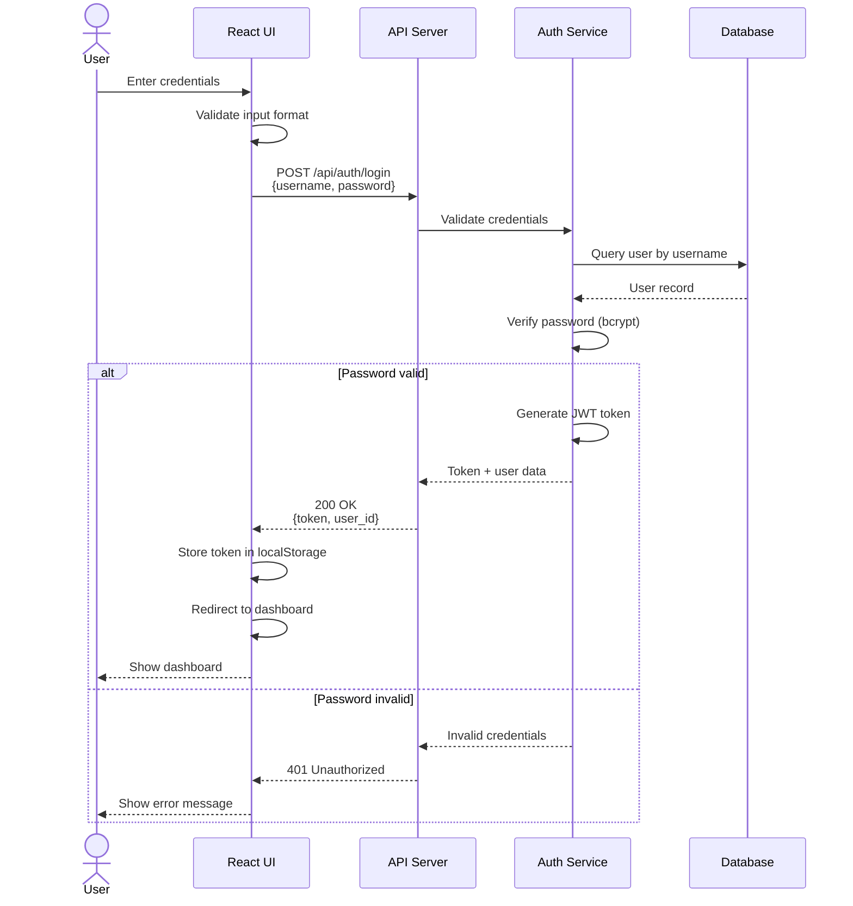
```mermaid
sequenceDiagram
    actor User
    participant UI as React UI
    participant API as API Server
    participant Auth as Auth Service
    participant DB as Database

    User->>UI: Enter credentials
    UI->>UI: Validate input format
    UI->>API: POST /api/auth/login<br/>{username, password}
    API->>Auth: Validate credentials
    Auth->>DB: Query user by username
    DB-->>Auth: User record
    Auth->>Auth: Verify password (bcrypt)

    alt Password valid
        Auth->>Auth: Generate JWT token
        Auth-->>API: Token + user data
        API-->>UI: 200 OK<br/>{token, user_id}
        UI->>UI: Store token in localStorage
        UI->>UI: Redirect to dashboard
        UI-->>User: Show dashboard
    else Password invalid
        Auth-->>API: Invalid credentials
        API-->>UI: 401 Unauthorized
        UI-->>User: Show error message
    end
```

---

## 2. Account Creation Flow

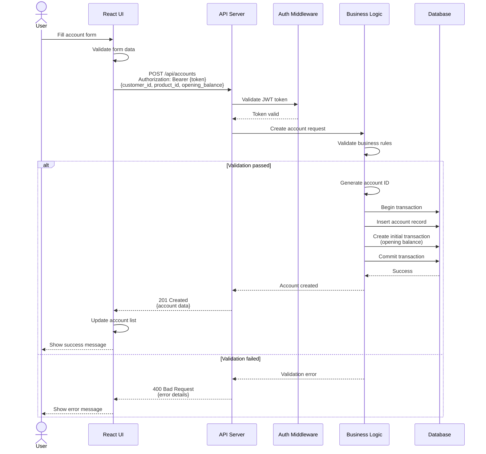
```mermaid
sequenceDiagram
    actor User
    participant UI as React UI
    participant API as API Server
    participant Auth as Auth Middleware
    participant BL as Business Logic
    participant DB as Database

    User->>UI: Fill account form
    UI->>UI: Validate form data
    UI->>API: POST /api/accounts<br/>Authorization: Bearer {token}<br/>{customer_id, product_id, opening_balance}

    API->>Auth: Validate JWT token
    Auth-->>API: Token valid

    API->>BL: Create account request
    BL->>BL: Validate business rules

    alt Validation passed
        BL->>BL: Generate account ID
        BL->>DB: Begin transaction
        BL->>DB: Insert account record
        BL->>DB: Create initial transaction<br/>(opening balance)
        BL->>DB: Commit transaction
        DB-->>BL: Success
        BL-->>API: Account created
        API-->>UI: 201 Created<br/>{account data}
        UI->>UI: Update account list
        UI-->>User: Show success message
    else Validation failed
        BL-->>API: Validation error
        API-->>UI: 400 Bad Request<br/>{error details}
        UI-->>User: Show error message
    end
```

---

## 3. Transaction Processing Flow

### Credit Transaction

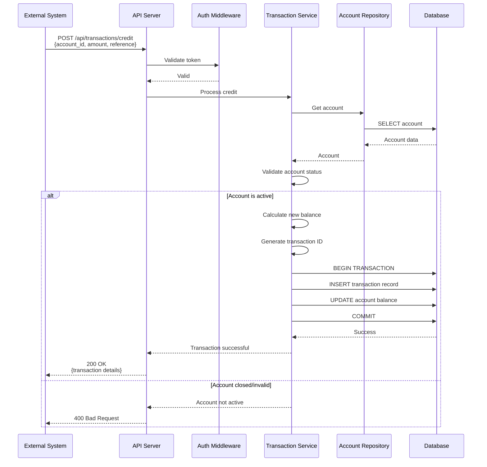
```mermaid
sequenceDiagram
    participant Client as External System
    participant API as API Server
    participant Auth as Auth Middleware
    participant TxService as Transaction Service
    participant AcctRepo as Account Repository
    participant DB as Database

    Client->>API: POST /api/transactions/credit<br/>{account_id, amount, reference}
    API->>Auth: Validate token
    Auth-->>API: Valid

    API->>TxService: Process credit
    TxService->>AcctRepo: Get account
    AcctRepo->>DB: SELECT account
    DB-->>AcctRepo: Account data
    AcctRepo-->>TxService: Account

    TxService->>TxService: Validate account status

    alt Account is active
        TxService->>TxService: Calculate new balance
        TxService->>TxService: Generate transaction ID
        TxService->>DB: BEGIN TRANSACTION
        TxService->>DB: INSERT transaction record
        TxService->>DB: UPDATE account balance
        TxService->>DB: COMMIT
        DB-->>TxService: Success
        TxService-->>API: Transaction successful
        API-->>Client: 200 OK<br/>{transaction details}
    else Account closed/invalid
        TxService-->>API: Account not active
        API-->>Client: 400 Bad Request
    end
```

### Debit Transaction

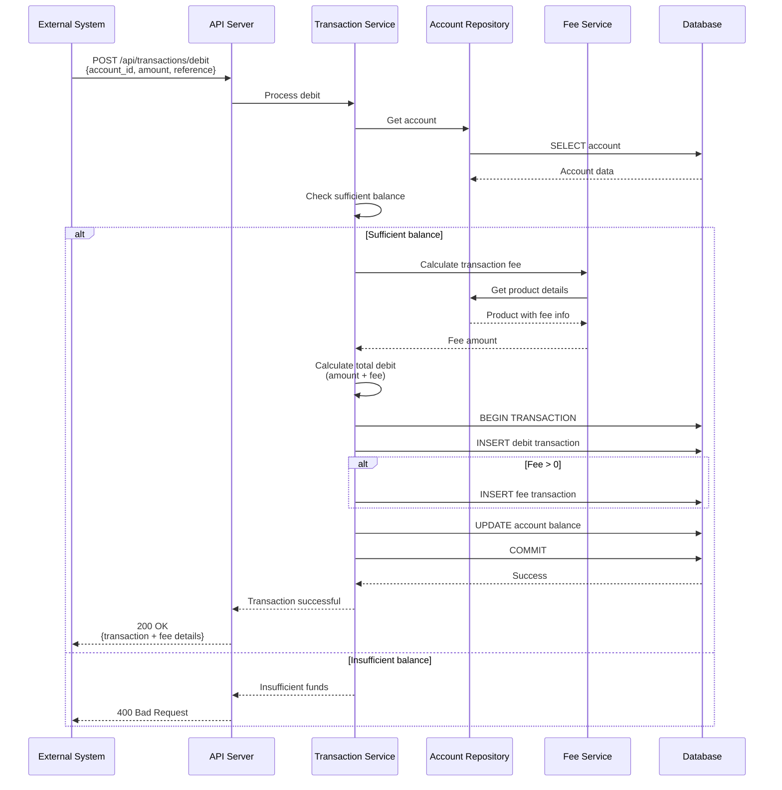
```mermaid
sequenceDiagram
    participant Client as External System
    participant API as API Server
    participant TxService as Transaction Service
    participant AcctRepo as Account Repository
    participant FeeService as Fee Service
    participant DB as Database

    Client->>API: POST /api/transactions/debit<br/>{account_id, amount, reference}
    API->>TxService: Process debit
    TxService->>AcctRepo: Get account
    AcctRepo->>DB: SELECT account
    DB-->>AcctRepo: Account data

    TxService->>TxService: Check sufficient balance

    alt Sufficient balance
        TxService->>FeeService: Calculate transaction fee
        FeeService->>AcctRepo: Get product details
        AcctRepo-->>FeeService: Product with fee info
        FeeService-->>TxService: Fee amount

        TxService->>TxService: Calculate total debit<br/>(amount + fee)
        TxService->>DB: BEGIN TRANSACTION
        TxService->>DB: INSERT debit transaction

        alt Fee > 0
            TxService->>DB: INSERT fee transaction
        end

        TxService->>DB: UPDATE account balance
        TxService->>DB: COMMIT
        DB-->>TxService: Success
        TxService-->>API: Transaction successful
        API-->>Client: 200 OK<br/>{transaction + fee details}
    else Insufficient balance
        TxService-->>API: Insufficient funds
        API-->>Client: 400 Bad Request
    end
```

---

## 4. Batch Interest Calculation Flow

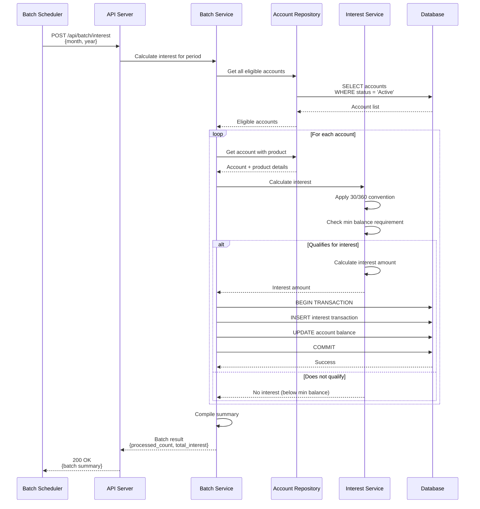
```mermaid
sequenceDiagram
    participant Scheduler as Batch Scheduler
    participant API as API Server
    participant BatchService as Batch Service
    participant AcctRepo as Account Repository
    participant IntService as Interest Service
    participant DB as Database

    Scheduler->>API: POST /api/batch/interest<br/>{month, year}
    API->>BatchService: Calculate interest for period

    BatchService->>AcctRepo: Get all eligible accounts
    AcctRepo->>DB: SELECT accounts<br/>WHERE status = 'Active'
    DB-->>AcctRepo: Account list
    AcctRepo-->>BatchService: Eligible accounts

    loop For each account
        BatchService->>AcctRepo: Get account with product
        AcctRepo-->>BatchService: Account + product details

        BatchService->>IntService: Calculate interest
        IntService->>IntService: Apply 30/360 convention
        IntService->>IntService: Check min balance requirement

        alt Qualifies for interest
            IntService->>IntService: Calculate interest amount
            IntService-->>BatchService: Interest amount

            BatchService->>DB: BEGIN TRANSACTION
            BatchService->>DB: INSERT interest transaction
            BatchService->>DB: UPDATE account balance
            BatchService->>DB: COMMIT
            DB-->>BatchService: Success
        else Does not qualify
            IntService-->>BatchService: No interest (below min balance)
        end
    end

    BatchService->>BatchService: Compile summary
    BatchService-->>API: Batch result<br/>{processed_count, total_interest}
    API-->>Scheduler: 200 OK<br/>{batch summary}
```

---

## 5. Ledger Retrieval Flow

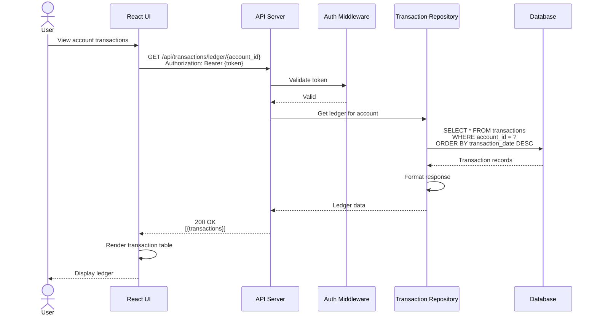
```mermaid
sequenceDiagram
    actor User
    participant UI as React UI
    participant API as API Server
    participant Auth as Auth Middleware
    participant TxRepo as Transaction Repository
    participant DB as Database

    User->>UI: View account transactions
    UI->>API: GET /api/transactions/ledger/{account_id}<br/>Authorization: Bearer {token}
    API->>Auth: Validate token
    Auth-->>API: Valid

    API->>TxRepo: Get ledger for account
    TxRepo->>DB: SELECT * FROM transactions<br/>WHERE account_id = ?<br/>ORDER BY transaction_date DESC
    DB-->>TxRepo: Transaction records
    TxRepo->>TxRepo: Format response
    TxRepo-->>API: Ledger data

    API-->>UI: 200 OK<br/>[{transactions}]
    UI->>UI: Render transaction table
    UI-->>User: Display ledger
```

---

## 6. Product Management Flow

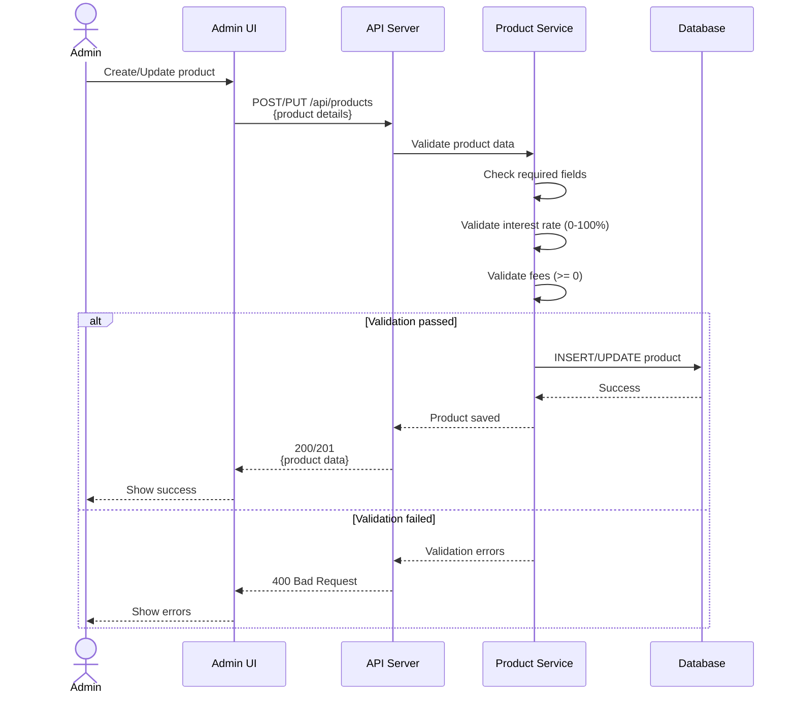
```mermaid
sequenceDiagram
    actor Admin
    participant UI as Admin UI
    participant API as API Server
    participant ProductService as Product Service
    participant DB as Database

    Admin->>UI: Create/Update product
    UI->>API: POST/PUT /api/products<br/>{product details}

    API->>ProductService: Validate product data
    ProductService->>ProductService: Check required fields
    ProductService->>ProductService: Validate interest rate (0-100%)
    ProductService->>ProductService: Validate fees (>= 0)

    alt Validation passed
        ProductService->>DB: INSERT/UPDATE product
        DB-->>ProductService: Success
        ProductService-->>API: Product saved
        API-->>UI: 200/201<br/>{product data}
        UI-->>Admin: Show success
    else Validation failed
        ProductService-->>API: Validation errors
        API-->>UI: 400 Bad Request
        UI-->>Admin: Show errors
    end
```

---

## 7. Customer Onboarding Flow

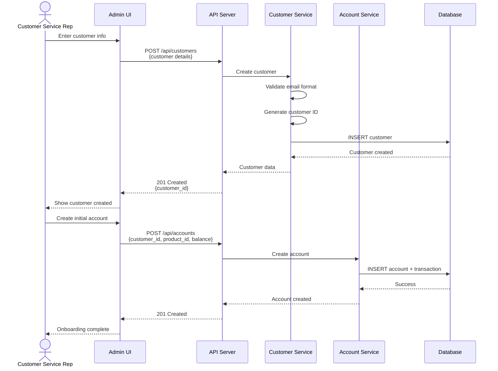
```mermaid
sequenceDiagram
    actor CSR as Customer Service Rep
    participant UI as Admin UI
    participant API as API Server
    participant CustService as Customer Service
    participant AcctService as Account Service
    participant DB as Database

    CSR->>UI: Enter customer info
    UI->>API: POST /api/customers<br/>{customer details}

    API->>CustService: Create customer
    CustService->>CustService: Validate email format
    CustService->>CustService: Generate customer ID
    CustService->>DB: INSERT customer
    DB-->>CustService: Customer created
    CustService-->>API: Customer data
    API-->>UI: 201 Created<br/>{customer_id}

    UI-->>CSR: Show customer created
    CSR->>UI: Create initial account
    UI->>API: POST /api/accounts<br/>{customer_id, product_id, balance}

    API->>AcctService: Create account
    AcctService->>DB: INSERT account + transaction
    DB-->>AcctService: Success
    AcctService-->>API: Account created
    API-->>UI: 201 Created
    UI-->>CSR: Onboarding complete
```

---

## 8. Monthly Fee Application Flow

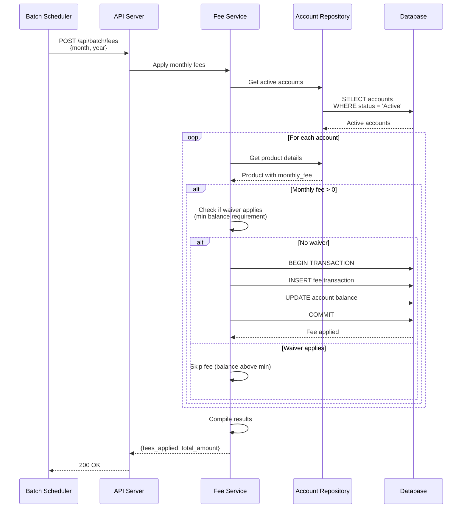
```mermaid
sequenceDiagram
    participant Scheduler as Batch Scheduler
    participant API as API Server
    participant FeeService as Fee Service
    participant AcctRepo as Account Repository
    participant DB as Database

    Scheduler->>API: POST /api/batch/fees<br/>{month, year}
    API->>FeeService: Apply monthly fees

    FeeService->>AcctRepo: Get active accounts
    AcctRepo->>DB: SELECT accounts<br/>WHERE status = 'Active'
    DB-->>AcctRepo: Active accounts

    loop For each account
        FeeService->>AcctRepo: Get product details
        AcctRepo-->>FeeService: Product with monthly_fee

        alt Monthly fee > 0
            FeeService->>FeeService: Check if waiver applies<br/>(min balance requirement)

            alt No waiver
                FeeService->>DB: BEGIN TRANSACTION
                FeeService->>DB: INSERT fee transaction
                FeeService->>DB: UPDATE account balance
                FeeService->>DB: COMMIT
                DB-->>FeeService: Fee applied
            else Waiver applies
                FeeService->>FeeService: Skip fee (balance above min)
            end
        end
    end

    FeeService->>FeeService: Compile results
    FeeService-->>API: {fees_applied, total_amount}
    API-->>Scheduler: 200 OK
```

---

## 9. Error Handling Flow

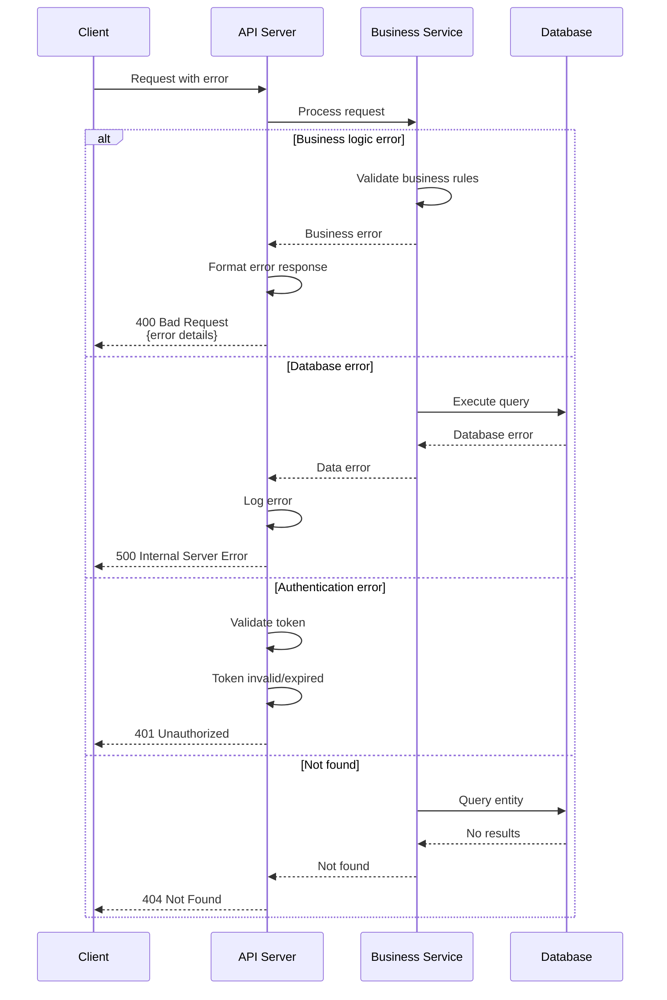
```mermaid
sequenceDiagram
    participant Client
    participant API as API Server
    participant Service as Business Service
    participant DB as Database

    Client->>API: Request with error
    API->>Service: Process request

    alt Business logic error
        Service->>Service: Validate business rules
        Service-->>API: Business error
        API->>API: Format error response
        API-->>Client: 400 Bad Request<br/>{error details}
    else Database error
        Service->>DB: Execute query
        DB-->>Service: Database error
        Service-->>API: Data error
        API->>API: Log error
        API-->>Client: 500 Internal Server Error
    else Authentication error
        API->>API: Validate token
        API->>API: Token invalid/expired
        API-->>Client: 401 Unauthorized
    else Not found
        Service->>DB: Query entity
        DB-->>Service: No results
        Service-->>API: Not found
        API-->>Client: 404 Not Found
    end
```

---

## 10. End-of-Day Processing Flow

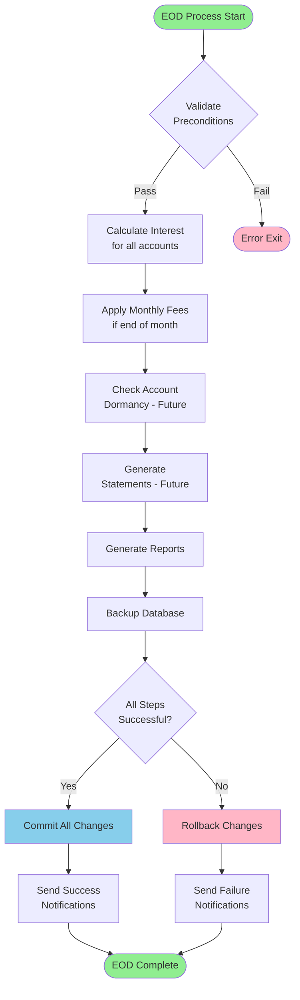
```mermaid
graph TB
    START([EOD Process Start]) --> VALIDATE{Validate<br/>Preconditions}

    VALIDATE -->|Pass| INTEREST[Calculate Interest<br/>for all accounts]
    VALIDATE -->|Fail| ERROR_END([Error Exit])

    INTEREST --> FEES[Apply Monthly Fees<br/>if end of month]
    FEES --> DORMANCY[Check Account<br/>Dormancy - Future]
    DORMANCY --> STATEMENTS[Generate<br/>Statements - Future]
    STATEMENTS --> REPORTS[Generate Reports]
    REPORTS --> BACKUP[Backup Database]

    BACKUP --> SUCCESS{All Steps<br/>Successful?}
    SUCCESS -->|Yes| COMMIT[Commit All Changes]
    SUCCESS -->|No| ROLLBACK[Rollback Changes]

    COMMIT --> NOTIFY_SUCCESS[Send Success<br/>Notifications]
    ROLLBACK --> NOTIFY_FAIL[Send Failure<br/>Notifications]

    NOTIFY_SUCCESS --> END([EOD Complete])
    NOTIFY_FAIL --> END

    style START fill:#90EE90
    style END fill:#90EE90
    style ERROR_END fill:#FFB6C6
    style COMMIT fill:#87CEEB
    style ROLLBACK fill:#FFB6C6
```

---

## 11. Multi-Account Transfer Flow (Future)

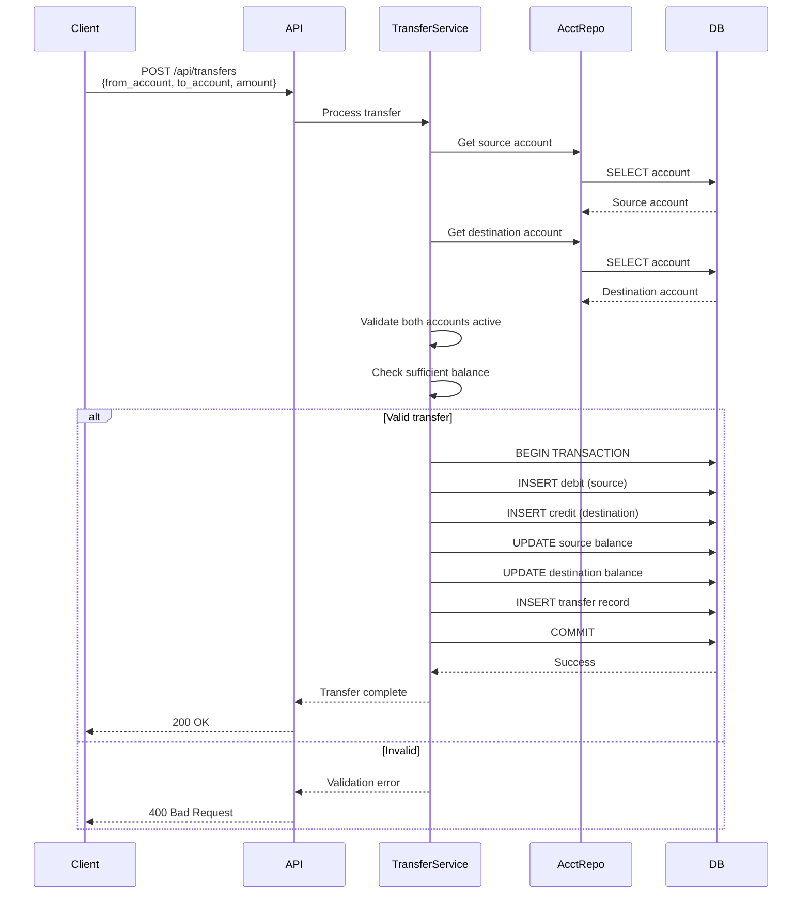
```mermaid
sequenceDiagram
    participant Client
    participant API
    participant TransferService
    participant AcctRepo
    participant DB

    Client->>API: POST /api/transfers<br/>{from_account, to_account, amount}
    API->>TransferService: Process transfer

    TransferService->>AcctRepo: Get source account
    AcctRepo->>DB: SELECT account
    DB-->>AcctRepo: Source account

    TransferService->>AcctRepo: Get destination account
    AcctRepo->>DB: SELECT account
    DB-->>AcctRepo: Destination account

    TransferService->>TransferService: Validate both accounts active
    TransferService->>TransferService: Check sufficient balance

    alt Valid transfer
        TransferService->>DB: BEGIN TRANSACTION
        TransferService->>DB: INSERT debit (source)
        TransferService->>DB: INSERT credit (destination)
        TransferService->>DB: UPDATE source balance
        TransferService->>DB: UPDATE destination balance
        TransferService->>DB: INSERT transfer record
        TransferService->>DB: COMMIT
        DB-->>TransferService: Success
        TransferService-->>API: Transfer complete
        API-->>Client: 200 OK
    else Invalid
        TransferService-->>API: Validation error
        API-->>Client: 400 Bad Request
    end
```

---

## 12. API Rate Limiting Flow (Future)

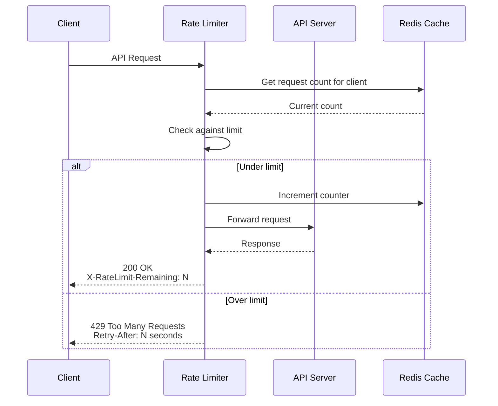
```mermaid
sequenceDiagram
    participant Client
    participant RateLimiter as Rate Limiter
    participant API as API Server
    participant Cache as Redis Cache

    Client->>RateLimiter: API Request
    RateLimiter->>Cache: Get request count for client
    Cache-->>RateLimiter: Current count

    RateLimiter->>RateLimiter: Check against limit

    alt Under limit
        RateLimiter->>Cache: Increment counter
        RateLimiter->>API: Forward request
        API-->>RateLimiter: Response
        RateLimiter-->>Client: 200 OK<br/>X-RateLimit-Remaining: N
    else Over limit
        RateLimiter-->>Client: 429 Too Many Requests<br/>Retry-After: N seconds
    end
```

---

## 13. Health Check Flow

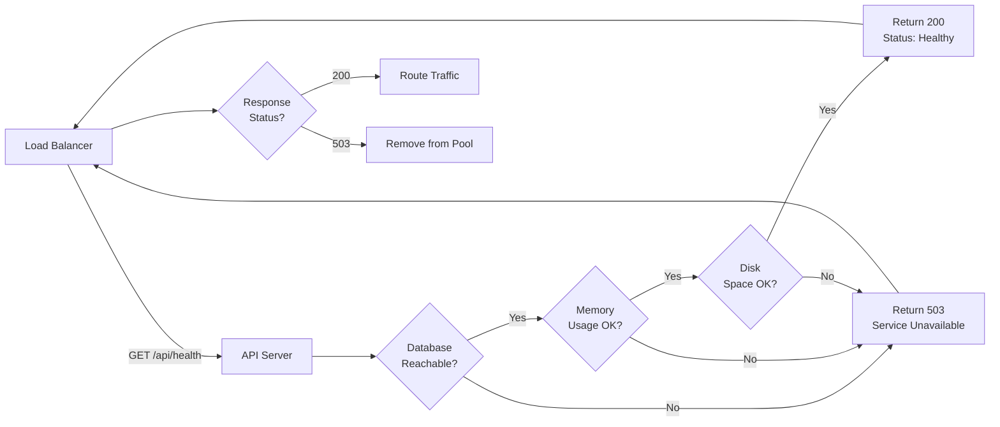
```mermaid
graph LR
    LB[Load Balancer] -->|GET /api/health| API[API Server]
    API --> DB_CHECK{Database<br/>Reachable?}

    DB_CHECK -->|Yes| MEM_CHECK{Memory<br/>Usage OK?}
    DB_CHECK -->|No| UNHEALTHY[Return 503<br/>Service Unavailable]

    MEM_CHECK -->|Yes| DISK_CHECK{Disk<br/>Space OK?}
    MEM_CHECK -->|No| UNHEALTHY

    DISK_CHECK -->|Yes| HEALTHY[Return 200<br/>Status: Healthy]
    DISK_CHECK -->|No| UNHEALTHY

    HEALTHY --> LB
    UNHEALTHY --> LB

    LB --> DECISION{Response<br/>Status?}
    DECISION -->|200| ROUTE[Route Traffic]
    DECISION -->|503| REMOVE[Remove from Pool]
```

---

## Integration Patterns Summary

| Pattern | Use Case | Implementation |
|---------|----------|----------------|
| **Request-Response** | User interactions, API calls | Synchronous REST API |
| **Batch Processing** | EOD operations, bulk updates | Scheduled batch jobs |
| **Event-Driven** | Real-time notifications (future) | Message queue + WebSocket |
| **Database Transaction** | Multi-step operations | ACID transactions |
| **Circuit Breaker** | External service calls (future) | Resilience patterns |
| **Retry Logic** | Transient failures | Exponential backoff |

---

## Error Code Reference

| Code | HTTP Status | Description | Recovery Action |
|------|-------------|-------------|-----------------|
| `AUTH_001` | 401 | Invalid credentials | Re-authenticate |
| `AUTH_002` | 401 | Token expired | Refresh token |
| `VAL_001` | 400 | Missing required field | Check request |
| `VAL_002` | 400 | Invalid format | Validate input |
| `BUS_001` | 400 | Insufficient balance | Add funds |
| `BUS_002` | 400 | Account closed | Contact support |
| `DB_001` | 500 | Database error | Retry or contact support |
| `SYS_001` | 503 | Service unavailable | Wait and retry |

---

**Document Owner**: David Kim, CTO
**Contributors**: Marcus Johnson (Backend), Nina Rodriguez (Frontend)
**Last Review**: October 2025
**Next Review**: January 2026

---

© 2025 Account Processing System | Internal Documentation
