# System Architecture
## Account Processing System

**Version**: 1.0
**Last Updated**: October 2025

---

## Overview

The Account Processing System follows a layered architecture pattern with clear separation of concerns across four primary layers: UI, API, Business Logic, and Data.

### Source Code Ownership Model

**Complete Technology Transfer**: Unlike proprietary banking solutions, the Account Processing System is delivered with **full source code access**. Financial institutions receive:

- **All source code** for UI, API, Business Logic, and Database layers
- **Build and deployment scripts** for complete operational control
- **Architecture documentation** enabling independent development
- **No licensing restrictions** on modifications or extensions
- **Freedom to evolve** the platform according to institutional needs

This open-access model eliminates vendor lock-in while providing enterprise-grade functionality, allowing banks to develop freely on top of the platform without restrictions or risks associated with proprietary systems.

**AI-Assisted Development Era**: In 2025 and beyond, source code access provides exponential value through AI coding assistants (GitHub Copilot, Claude Code, ChatGPT). These tools can:
- Analyze and understand the complete codebase instantly
- Generate custom features and enhancements in hours instead of months
- Reduce development costs by 60-80% compared to vendor-led customizations
- Enable rapid prototyping and innovation cycles
- Provide automated documentation and testing assistance

Unlike proprietary systems where AI tools are locked out, clients can leverage cutting-edge AI development tools to accelerate their customization roadmap dramatically.

---

## High-Level Architecture

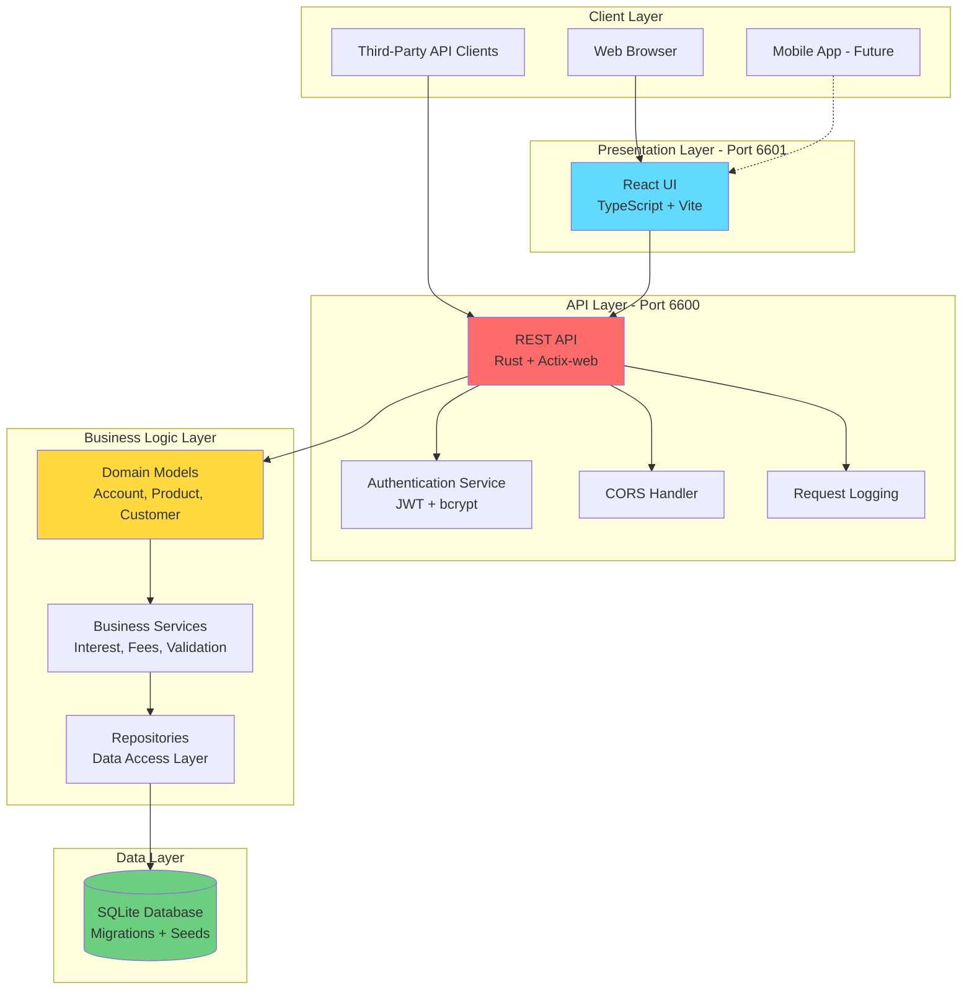

---

## Component Architecture

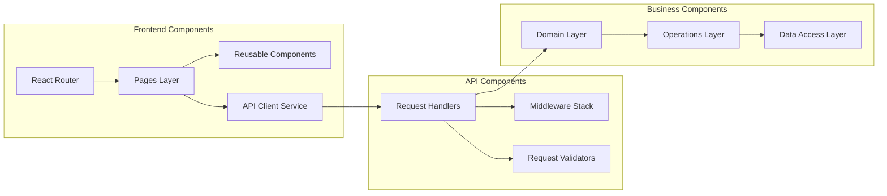

---

## Data Flow Architecture

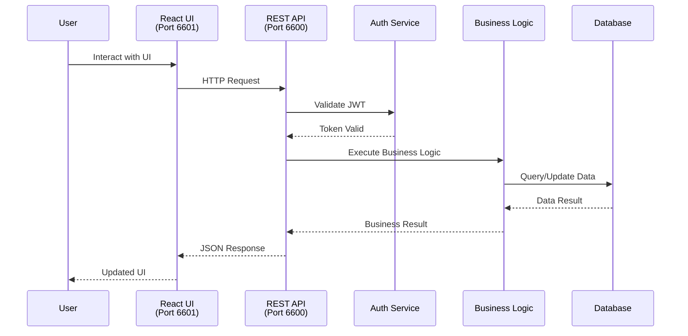

---

## Deployment Architecture

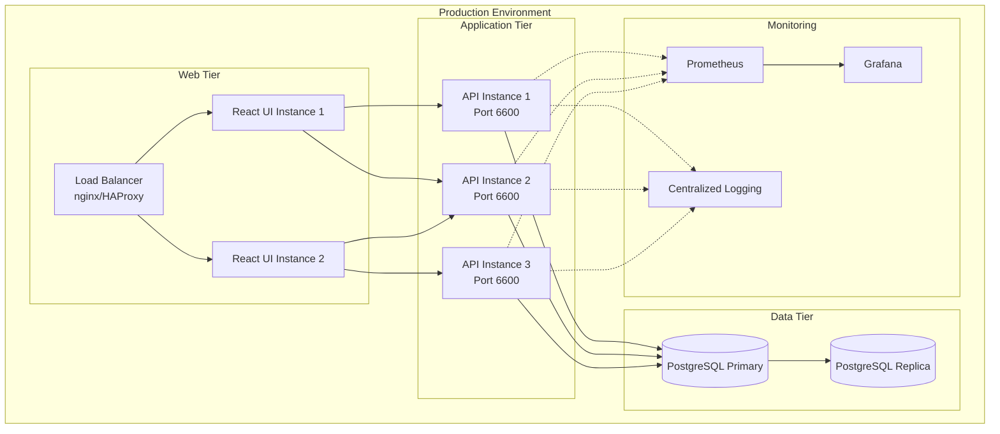

---

## Security Architecture

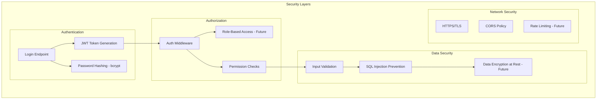

---

## Technology Stack

### Frontend
- **Framework**: React 18
- **Language**: TypeScript
- **Build Tool**: Vite
- **Routing**: React Router DOM
- **HTTP Client**: Fetch API
- **Port**: 6601

### Backend API
- **Language**: Rust
- **Framework**: Actix-web
- **Authentication**: JWT (jsonwebtoken crate)
- **Password Hashing**: bcrypt
- **Serialization**: serde + serde_json
- **Port**: 6600

### Business Logic
- **Language**: Rust
- **Pattern**: Repository Pattern
- **Domain Models**: Strong typing with Rust structs
- **Validation**: Custom validators

### Database
- **Development**: SQLite
- **Production**: PostgreSQL (recommended)
- **Migration Tool**: Custom SQL scripts
- **ORM**: rusqlite (development)

---

## API Architecture

### Endpoint Structure

```
/api
├── /health                    # Health check
├── /auth
│   └── /login                # Authentication
├── /products
│   ├── GET    /              # List all products
│   ├── POST   /              # Create product
│   ├── GET    /{id}          # Get product
│   └── PUT    /{id}          # Update product
├── /customers
│   ├── GET    /              # List all customers
│   ├── POST   /              # Create customer
│   └── GET    /{id}          # Get customer
├── /accounts
│   ├── GET    /              # List all accounts
│   ├── POST   /              # Create account
│   └── GET    /{id}          # Get account
├── /transactions
│   ├── POST   /credit        # Credit transaction
│   ├── POST   /debit         # Debit transaction
│   └── GET    /ledger/{id}   # Get ledger
└── /batch
    ├── POST   /interest      # Calculate interest
    └── POST   /fees          # Apply fees
```

### Response Format

All API responses follow this structure:

```json
{
  "success": true,
  "data": { ... },
  "message": "Operation successful",
  "timestamp": "2025-10-05T12:00:00Z"
}
```

Error responses:

```json
{
  "success": false,
  "error": {
    "code": "VALIDATION_ERROR",
    "message": "Invalid input provided",
    "details": { ... }
  },
  "timestamp": "2025-10-05T12:00:00Z"
}
```

---

## Data Model Architecture

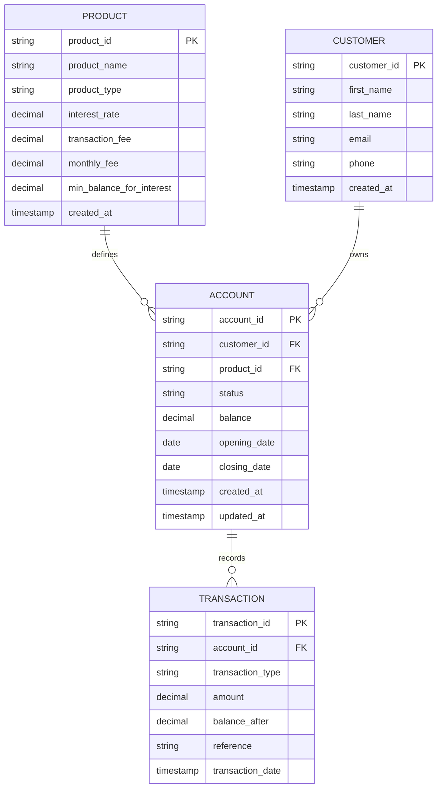

---

## Integration Architecture

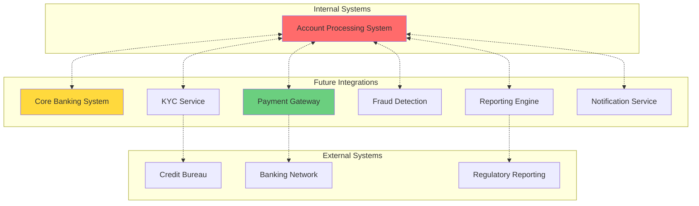

---

## Scalability Architecture

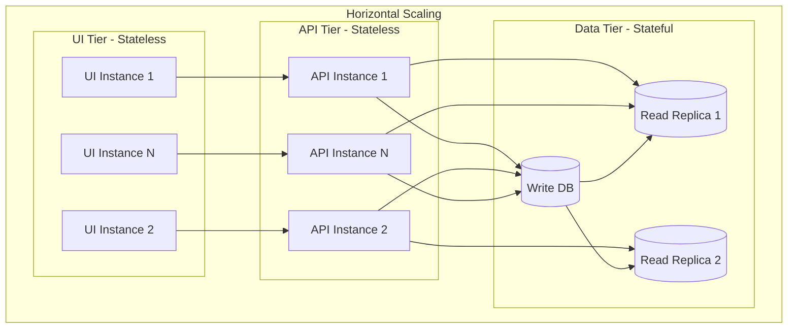

### Scaling Strategy

1. **UI Layer**: Add more instances behind load balancer
2. **API Layer**: Horizontal scaling with container orchestration (Kubernetes)
3. **Data Layer**: Read replicas for query performance, write master for consistency
4. **Caching**: Redis/Memcached for frequently accessed data (future)
5. **Message Queue**: Async processing for batch operations (future)

---

## Performance Characteristics

| Component | Metric | Current | Target |
|-----------|--------|---------|--------|
| UI Load Time | Initial render | < 2s | < 1s |
| API Response | Average latency | 45ms | < 100ms |
| API Response | P95 latency | 120ms | < 200ms |
| API Response | P99 latency | 280ms | < 500ms |
| Database | Query time | < 10ms | < 50ms |
| Throughput | Requests/sec | 500+ | 5000+ |
| Concurrent Users | Supported | 100+ | 1000+ |

---

## Monitoring & Observability

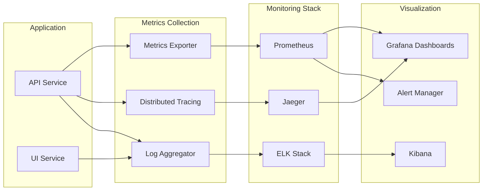

---

## Disaster Recovery Architecture

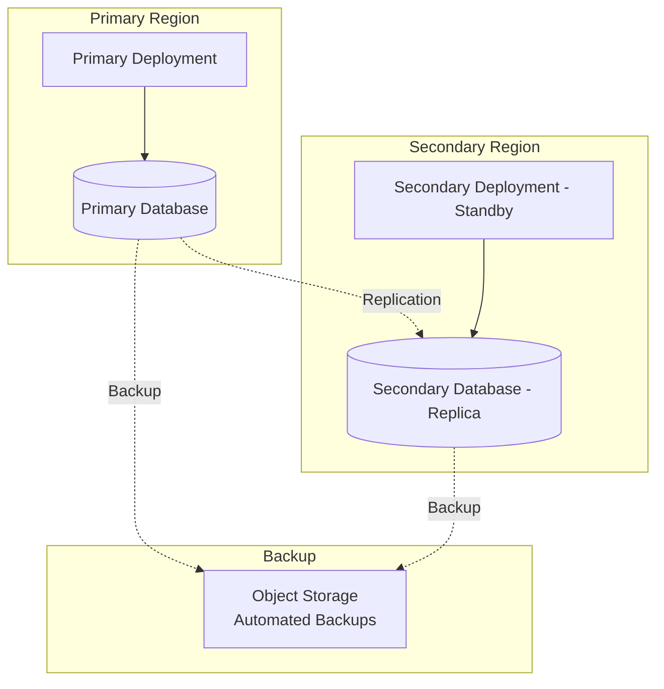

### Recovery Objectives

- **RTO (Recovery Time Objective)**: < 1 hour
- **RPO (Recovery Point Objective)**: < 15 minutes
- **Backup Frequency**: Every 6 hours
- **Backup Retention**: 30 days

---

## Development Architecture

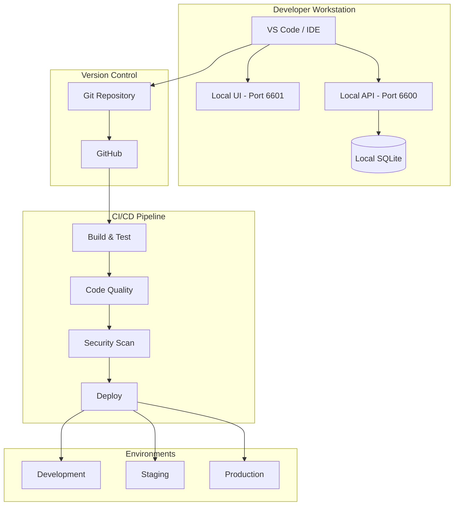

---

## Future Architecture Enhancements

### Phase 2 (Q1 2026)
- Event-driven architecture with message queues
- Caching layer (Redis)
- API Gateway with rate limiting
- Advanced monitoring and tracing

### Phase 3 (Q2 2026)
- Microservices decomposition
- Service mesh (Istio/Linkerd)
- GraphQL API option
- Real-time notifications (WebSocket)

### Phase 4 (Q3-Q4 2026)
- Multi-tenancy support
- Advanced analytics platform
- Machine learning integration
- Mobile native SDKs

---

## Architecture Decision Records (ADRs)

Key architectural decisions are documented in separate ADR files:

1. **ADR-001**: Use of Rust for backend services
2. **ADR-002**: SQLite for development, PostgreSQL for production
3. **ADR-003**: JWT for authentication
4. **ADR-004**: Repository pattern for data access
5. **ADR-005**: React with TypeScript for UI

See `/docs/architecture/adr/` for detailed decision records.

---

**Document Owner**: David Kim, CTO
**Contributors**: Engineering Team
**Last Review**: October 2025
**Next Review**: January 2026

---

© 2025 Account Processing System | Internal Documentation
