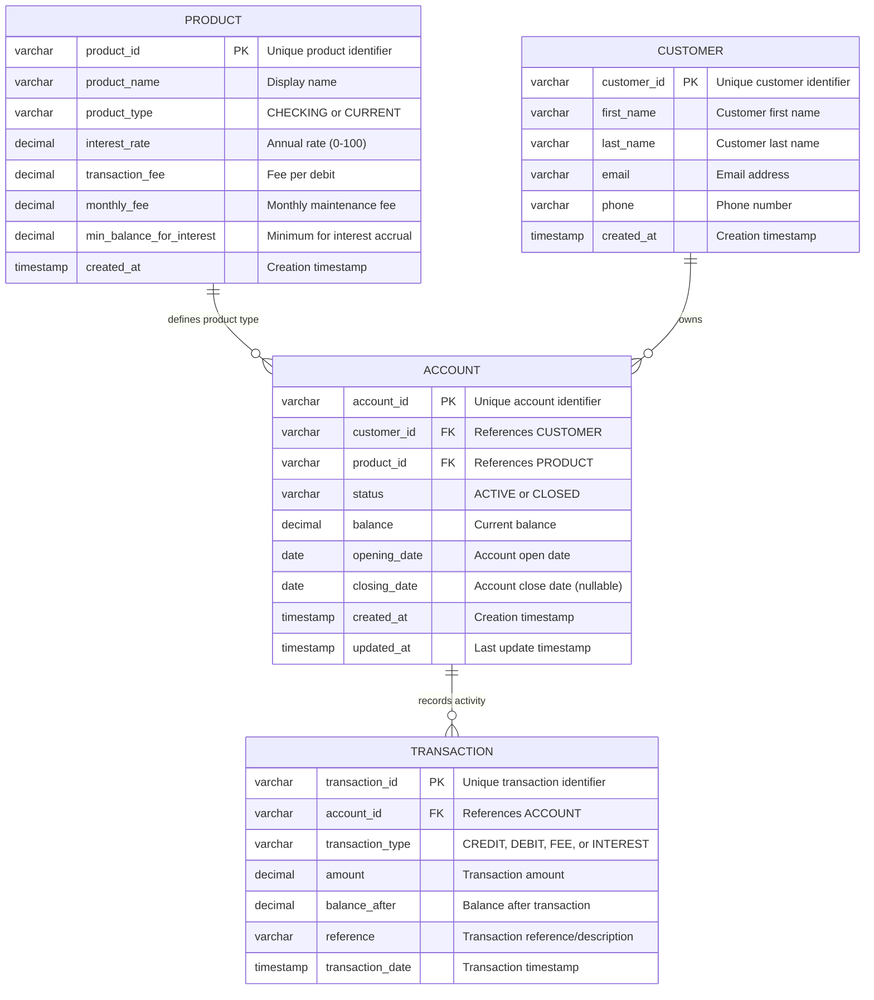
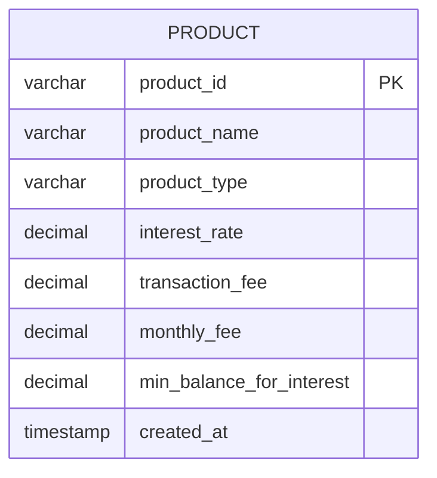
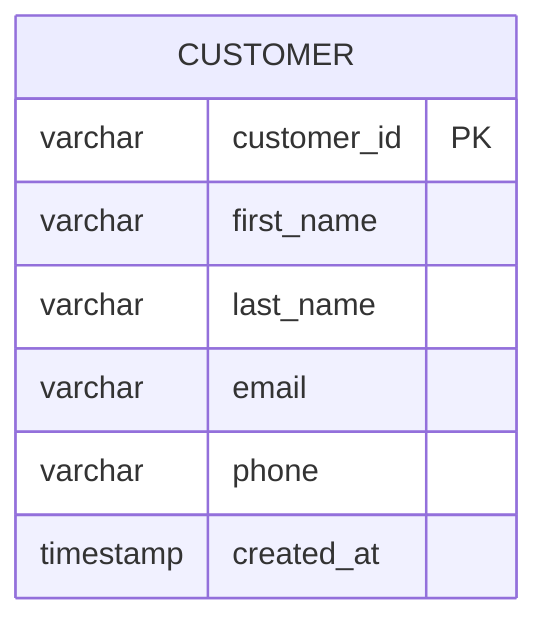
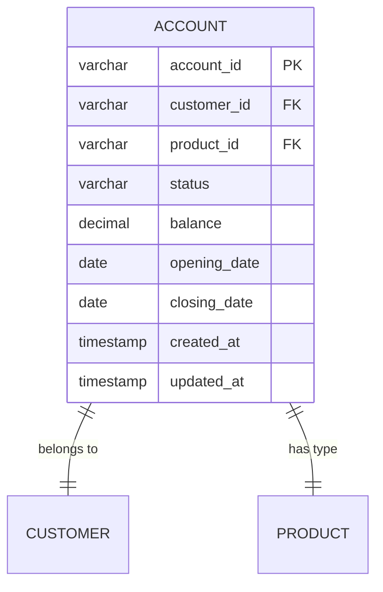
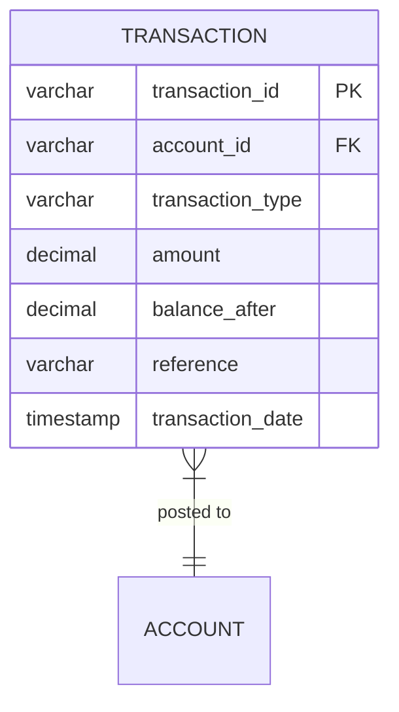
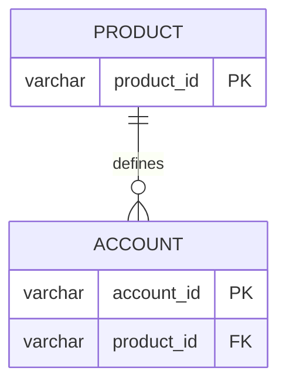
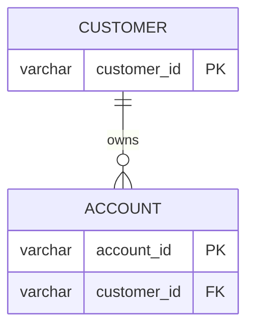
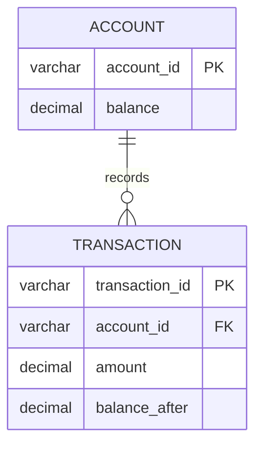

# Entity Relationship Diagrams
## Account Processing System Database

**Version**: 1.0
**Last Updated**: October 2025
**Database**: SQLite (Development), PostgreSQL (Production)

---

## Overview

This document provides comprehensive Entity-Relationship Diagrams (ERD) for the Account Processing System database schema.

---

## Complete Database ERD



---

## Detailed Entity Definitions

### PRODUCT Entity

**Purpose**: Defines the product catalog for accounts



**Attributes**:

| Column | Type | Constraints | Description |
|--------|------|-------------|-------------|
| `product_id` | VARCHAR(20) | PRIMARY KEY | Format: PROD-XXX |
| `product_name` | VARCHAR(100) | NOT NULL | Human-readable name |
| `product_type` | VARCHAR(20) | NOT NULL | CHECKING or CURRENT |
| `interest_rate` | DECIMAL(5,2) | NOT NULL, >= 0 | Annual % (e.g., 2.50 for 2.5%) |
| `transaction_fee` | DECIMAL(10,2) | NOT NULL, >= 0 | Fee per debit transaction |
| `monthly_fee` | DECIMAL(10,2) | NOT NULL, >= 0 | Monthly maintenance fee |
| `min_balance_for_interest` | DECIMAL(15,2) | NOT NULL, >= 0 | Min balance to earn interest |
| `created_at` | TIMESTAMP | NOT NULL | Auto-generated |

**Business Rules**:
- Product ID must be unique
- Interest rate cannot exceed 100%
- All fees must be non-negative
- Product type must be CHECKING or CURRENT

**Sample Data**:
```sql
INSERT INTO product VALUES
  ('PROD-001', 'Basic Checking', 'CHECKING', 0.50, 0.25, 5.00, 500.00, CURRENT_TIMESTAMP),
  ('PROD-002', 'Premium Checking', 'CHECKING', 2.00, 0.00, 15.00, 2500.00, CURRENT_TIMESTAMP),
  ('PROD-003', 'Student Checking', 'CHECKING', 0.10, 0.00, 0.00, 0.00, CURRENT_TIMESTAMP);
```

---

### CUSTOMER Entity

**Purpose**: Stores customer information



**Attributes**:

| Column | Type | Constraints | Description |
|--------|------|-------------|-------------|
| `customer_id` | VARCHAR(20) | PRIMARY KEY | Format: CUST-XXXX |
| `first_name` | VARCHAR(50) | NOT NULL | Customer first name |
| `last_name` | VARCHAR(50) | NOT NULL | Customer last name |
| `email` | VARCHAR(100) | NOT NULL | Email address |
| `phone` | VARCHAR(20) | NULL | Phone number |
| `created_at` | TIMESTAMP | NOT NULL | Auto-generated |

**Business Rules**:
- Customer ID must be unique
- Email should be unique (not enforced in MVP)
- Name fields are required

**Sample Data**:
```sql
INSERT INTO customer VALUES
  ('CUST-0001', 'John', 'Doe', 'john.doe@example.com', '+1-555-0101', CURRENT_TIMESTAMP),
  ('CUST-0002', 'Jane', 'Smith', 'jane.smith@example.com', '+1-555-0102', CURRENT_TIMESTAMP);
```

---

### ACCOUNT Entity

**Purpose**: Represents customer accounts



**Attributes**:

| Column | Type | Constraints | Description |
|--------|------|-------------|-------------|
| `account_id` | VARCHAR(20) | PRIMARY KEY | Format: ACCT-XXXXXXXX |
| `customer_id` | VARCHAR(20) | FOREIGN KEY → CUSTOMER | Owner reference |
| `product_id` | VARCHAR(20) | FOREIGN KEY → PRODUCT | Product reference |
| `status` | VARCHAR(20) | NOT NULL | ACTIVE or CLOSED |
| `balance` | DECIMAL(15,2) | NOT NULL | Current balance |
| `opening_date` | DATE | NOT NULL | Open date |
| `closing_date` | DATE | NULL | Close date (if closed) |
| `created_at` | TIMESTAMP | NOT NULL | Auto-generated |
| `updated_at` | TIMESTAMP | NOT NULL | Auto-updated |

**Business Rules**:
- Account ID must be unique
- Balance is updated only via transactions
- Status can only be ACTIVE or CLOSED
- Closed accounts have a closing_date
- Customer and Product must exist (referential integrity)

**Indexes**:
```sql
CREATE INDEX idx_account_customer ON account(customer_id);
CREATE INDEX idx_account_product ON account(product_id);
CREATE INDEX idx_account_status ON account(status);
```

**Sample Data**:
```sql
INSERT INTO account VALUES
  ('ACCT-00000001', 'CUST-0001', 'PROD-001', 'ACTIVE', 5000.00, '2024-01-15', NULL, CURRENT_TIMESTAMP, CURRENT_TIMESTAMP),
  ('ACCT-00000002', 'CUST-0002', 'PROD-002', 'ACTIVE', 15000.00, '2024-02-01', NULL, CURRENT_TIMESTAMP, CURRENT_TIMESTAMP);
```

---

### TRANSACTION Entity

**Purpose**: Logs all account activity



**Attributes**:

| Column | Type | Constraints | Description |
|--------|------|-------------|-------------|
| `transaction_id` | VARCHAR(30) | PRIMARY KEY | Format: TXN-timestamp-random |
| `account_id` | VARCHAR(20) | FOREIGN KEY → ACCOUNT | Account reference |
| `transaction_type` | VARCHAR(20) | NOT NULL | CREDIT/DEBIT/FEE/INTEREST |
| `amount` | DECIMAL(15,2) | NOT NULL | Transaction amount |
| `balance_after` | DECIMAL(15,2) | NOT NULL | Balance after transaction |
| `reference` | VARCHAR(200) | NULL | Description/reference |
| `transaction_date` | TIMESTAMP | NOT NULL | Transaction timestamp |

**Transaction Types**:

| Type | Description | Sign | Example |
|------|-------------|------|---------|
| `CREDIT` | Deposit/incoming | + | Customer deposit |
| `DEBIT` | Withdrawal/outgoing | - | Customer withdrawal |
| `FEE` | Fee charge | - | Transaction fee, monthly fee |
| `INTEREST` | Interest accrual | + | Monthly interest |

**Business Rules**:
- Transaction ID must be unique
- Amount is always positive (sign determined by type)
- Balance_after must match account balance after transaction
- Account must exist (referential integrity)
- Transactions are immutable (never updated or deleted)

**Indexes**:
```sql
CREATE INDEX idx_transaction_account ON transaction(account_id);
CREATE INDEX idx_transaction_date ON transaction(transaction_date);
CREATE INDEX idx_transaction_type ON transaction(transaction_type);
```

**Sample Data**:
```sql
INSERT INTO transaction VALUES
  ('TXN-20241015-ABC123', 'ACCT-00000001', 'CREDIT', 5000.00, 5000.00, 'Opening balance', '2024-01-15 10:00:00'),
  ('TXN-20241016-DEF456', 'ACCT-00000001', 'DEBIT', 100.00, 4900.00, 'ATM withdrawal', '2024-01-16 14:30:00');
```

---

## Relationship Details

### PRODUCT ← ACCOUNT (One-to-Many)



**Relationship**: One product can define many accounts
- **Cardinality**: 1:N
- **Cascade**: ON DELETE RESTRICT (cannot delete product with active accounts)
- **Business Rule**: Account must have a valid product

---

### CUSTOMER ← ACCOUNT (One-to-Many)



**Relationship**: One customer can own many accounts
- **Cardinality**: 1:N
- **Cascade**: ON DELETE RESTRICT (cannot delete customer with accounts)
- **Business Rule**: Account must have a valid customer owner

---

### ACCOUNT ← TRANSACTION (One-to-Many)



**Relationship**: One account can have many transactions
- **Cardinality**: 1:N
- **Cascade**: ON DELETE RESTRICT (cannot delete account with transactions)
- **Business Rule**:
  - Transaction must reference valid account
  - Balance_after must match account.balance after transaction

---

## Database Schema DDL

### Complete Schema

```sql
-- Products table
CREATE TABLE product (
    product_id VARCHAR(20) PRIMARY KEY,
    product_name VARCHAR(100) NOT NULL,
    product_type VARCHAR(20) NOT NULL CHECK (product_type IN ('CHECKING', 'CURRENT')),
    interest_rate DECIMAL(5,2) NOT NULL CHECK (interest_rate >= 0 AND interest_rate <= 100),
    transaction_fee DECIMAL(10,2) NOT NULL CHECK (transaction_fee >= 0),
    monthly_fee DECIMAL(10,2) NOT NULL CHECK (monthly_fee >= 0),
    min_balance_for_interest DECIMAL(15,2) NOT NULL CHECK (min_balance_for_interest >= 0),
    created_at TIMESTAMP NOT NULL DEFAULT CURRENT_TIMESTAMP
);

-- Customers table
CREATE TABLE customer (
    customer_id VARCHAR(20) PRIMARY KEY,
    first_name VARCHAR(50) NOT NULL,
    last_name VARCHAR(50) NOT NULL,
    email VARCHAR(100) NOT NULL,
    phone VARCHAR(20),
    created_at TIMESTAMP NOT NULL DEFAULT CURRENT_TIMESTAMP
);

-- Accounts table
CREATE TABLE account (
    account_id VARCHAR(20) PRIMARY KEY,
    customer_id VARCHAR(20) NOT NULL,
    product_id VARCHAR(20) NOT NULL,
    status VARCHAR(20) NOT NULL CHECK (status IN ('ACTIVE', 'CLOSED')),
    balance DECIMAL(15,2) NOT NULL DEFAULT 0.00,
    opening_date DATE NOT NULL,
    closing_date DATE,
    created_at TIMESTAMP NOT NULL DEFAULT CURRENT_TIMESTAMP,
    updated_at TIMESTAMP NOT NULL DEFAULT CURRENT_TIMESTAMP,
    FOREIGN KEY (customer_id) REFERENCES customer(customer_id),
    FOREIGN KEY (product_id) REFERENCES product(product_id)
);

-- Transactions table
CREATE TABLE transaction (
    transaction_id VARCHAR(30) PRIMARY KEY,
    account_id VARCHAR(20) NOT NULL,
    transaction_type VARCHAR(20) NOT NULL CHECK (transaction_type IN ('CREDIT', 'DEBIT', 'FEE', 'INTEREST')),
    amount DECIMAL(15,2) NOT NULL CHECK (amount > 0),
    balance_after DECIMAL(15,2) NOT NULL,
    reference VARCHAR(200),
    transaction_date TIMESTAMP NOT NULL DEFAULT CURRENT_TIMESTAMP,
    FOREIGN KEY (account_id) REFERENCES account(account_id)
);

-- Indexes
CREATE INDEX idx_account_customer ON account(customer_id);
CREATE INDEX idx_account_product ON account(product_id);
CREATE INDEX idx_account_status ON account(status);
CREATE INDEX idx_transaction_account ON transaction(account_id);
CREATE INDEX idx_transaction_date ON transaction(transaction_date);
CREATE INDEX idx_transaction_type ON transaction(transaction_type);
```

---

## Data Integrity Constraints

### Primary Keys
- `product.product_id`
- `customer.customer_id`
- `account.account_id`
- `transaction.transaction_id`

### Foreign Keys
- `account.customer_id → customer.customer_id`
- `account.product_id → product.product_id`
- `transaction.account_id → account.account_id`

### Check Constraints
- `product.product_type IN ('CHECKING', 'CURRENT')`
- `product.interest_rate BETWEEN 0 AND 100`
- `product.transaction_fee >= 0`
- `product.monthly_fee >= 0`
- `product.min_balance_for_interest >= 0`
- `account.status IN ('ACTIVE', 'CLOSED')`
- `transaction.transaction_type IN ('CREDIT', 'DEBIT', 'FEE', 'INTEREST')`
- `transaction.amount > 0`

---

## Normalization Analysis

### Current Normalization Level: **3NF (Third Normal Form)**

#### 1NF (First Normal Form) ✅
- All attributes contain atomic values
- Each column has a unique name
- No repeating groups

#### 2NF (Second Normal Form) ✅
- All non-key attributes are fully dependent on the primary key
- No partial dependencies exist

#### 3NF (Third Normal Form) ✅
- No transitive dependencies
- All non-key attributes depend only on the primary key

### Potential Denormalization Opportunities

For performance optimization (future consideration):

1. **Account Summary Table** (Materialized View)
```sql
CREATE TABLE account_summary (
    account_id VARCHAR(20) PRIMARY KEY,
    customer_name VARCHAR(100),
    product_name VARCHAR(100),
    current_balance DECIMAL(15,2),
    last_transaction_date TIMESTAMP,
    transaction_count INTEGER
);
```

2. **Monthly Balance Snapshots**
```sql
CREATE TABLE monthly_balance (
    snapshot_id VARCHAR(30) PRIMARY KEY,
    account_id VARCHAR(20),
    month INTEGER,
    year INTEGER,
    closing_balance DECIMAL(15,2),
    interest_earned DECIMAL(15,2),
    fees_charged DECIMAL(15,2)
);
```

---

## Sample Queries

### Get Account with Customer and Product Details
```sql
SELECT
    a.account_id,
    a.balance,
    a.status,
    c.first_name || ' ' || c.last_name AS customer_name,
    c.email,
    p.product_name,
    p.interest_rate
FROM account a
JOIN customer c ON a.customer_id = c.customer_id
JOIN product p ON a.product_id = p.product_id
WHERE a.account_id = 'ACCT-00000001';
```

### Get Transaction Ledger for Account
```sql
SELECT
    transaction_id,
    transaction_type,
    amount,
    balance_after,
    reference,
    transaction_date
FROM transaction
WHERE account_id = 'ACCT-00000001'
ORDER BY transaction_date DESC;
```

### Calculate Total Balances by Product
```sql
SELECT
    p.product_name,
    COUNT(a.account_id) AS account_count,
    SUM(a.balance) AS total_balance
FROM product p
LEFT JOIN account a ON p.product_id = a.product_id AND a.status = 'ACTIVE'
GROUP BY p.product_id, p.product_name;
```

### Find Accounts Eligible for Interest
```sql
SELECT
    a.account_id,
    a.balance,
    p.product_name,
    p.interest_rate,
    p.min_balance_for_interest
FROM account a
JOIN product p ON a.product_id = p.product_id
WHERE a.status = 'ACTIVE'
  AND a.balance >= p.min_balance_for_interest
  AND p.interest_rate > 0;
```

---

## Future Schema Enhancements

### Planned Additions (Q1 2026)

1. **User/Authentication Table**
```sql
CREATE TABLE user (
    user_id VARCHAR(20) PRIMARY KEY,
    username VARCHAR(50) UNIQUE NOT NULL,
    password_hash VARCHAR(255) NOT NULL,
    role VARCHAR(20) NOT NULL,
    created_at TIMESTAMP NOT NULL
);
```

2. **Audit Log Table**
```sql
CREATE TABLE audit_log (
    log_id VARCHAR(30) PRIMARY KEY,
    entity_type VARCHAR(20) NOT NULL,
    entity_id VARCHAR(20) NOT NULL,
    action VARCHAR(20) NOT NULL,
    user_id VARCHAR(20),
    changes TEXT,
    timestamp TIMESTAMP NOT NULL
);
```

3. **Scheduled Transactions**
```sql
CREATE TABLE scheduled_transaction (
    schedule_id VARCHAR(30) PRIMARY KEY,
    account_id VARCHAR(20) NOT NULL,
    transaction_type VARCHAR(20) NOT NULL,
    amount DECIMAL(15,2) NOT NULL,
    frequency VARCHAR(20) NOT NULL,
    next_execution_date DATE NOT NULL,
    FOREIGN KEY (account_id) REFERENCES account(account_id)
);
```

---

## Database Statistics

**Current Schema Size**:
- Tables: 4
- Relationships: 3
- Indexes: 6 (excluding primary keys)
- Constraints: 11

**Sample Data Volume**:
- Products: 6 records
- Customers: 6 records
- Accounts: 6 records
- Transactions: ~50+ records

---

**Document Owner**: Raj Sharma, Senior Software Engineer (Data & Integration)
**Contributors**: Database Team
**Last Review**: October 2025
**Next Review**: January 2026

---

© 2025 Account Processing System | Internal Documentation
