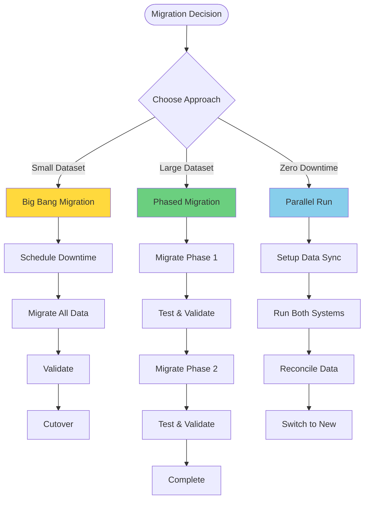

# Data Migration Guide
## Account Processing System

**Version**: 1.0
**Last Updated**: October 2025
**Target Audience**: Database Administrators, DevOps Engineers

---

## Overview

This guide provides comprehensive instructions for migrating data to and from the Account Processing System, including legacy system migrations, database upgrades, and data transformation procedures.

---

## Table of Contents

1. [Migration Strategy](#migration-strategy)
2. [Pre-Migration Checklist](#pre-migration-checklist)
3. [Legacy System Migration](#legacy-system-migration)
4. [Database Platform Migration](#database-platform-migration)
5. [Data Transformation](#data-transformation)
6. [Validation & Testing](#validation--testing)
7. [Rollback Procedures](#rollback-procedures)
8. [Post-Migration Tasks](#post-migration-tasks)

---

## Migration Strategy

### Migration Approaches



### Recommended Approach by Data Volume

| Data Volume | Accounts | Transactions | Recommended Approach | Est. Downtime |
|-------------|----------|--------------|----------------------|---------------|
| **Small** | < 10,000 | < 100,000 | Big Bang | 2-4 hours |
| **Medium** | 10K-100K | 100K-1M | Phased | 4-8 hours |
| **Large** | 100K-1M | 1M-10M | Parallel Run | Near-zero |
| **Enterprise** | > 1M | > 10M | Parallel Run | Zero |

---

## Pre-Migration Checklist

### 1. Assessment Phase

```bash
# Check source database size
SELECT
    COUNT(*) as total_accounts,
    SUM(CASE WHEN status = 'ACTIVE' THEN 1 ELSE 0 END) as active_accounts,
    SUM(balance) as total_balance
FROM legacy_accounts;

# Check transaction volume
SELECT
    COUNT(*) as total_transactions,
    MIN(transaction_date) as earliest_date,
    MAX(transaction_date) as latest_date
FROM legacy_transactions;
```

**Checklist**:
- [ ] Source database access confirmed
- [ ] Target database provisioned
- [ ] Data volume assessed
- [ ] Network bandwidth verified
- [ ] Migration windows identified
- [ ] Stakeholder approval obtained
- [ ] Rollback plan prepared
- [ ] Backup strategy confirmed

### 2. Environment Setup

```bash
# Create migration environment
export SOURCE_DB="legacy_system.db"
export TARGET_DB="accounts.db"
export BACKUP_DIR="/backups/migration_$(date +%Y%m%d)"
export LOG_DIR="/logs/migration_$(date +%Y%m%d)"

# Create directories
mkdir -p $BACKUP_DIR
mkdir -p $LOG_DIR

# Backup source database
sqlite3 $SOURCE_DB ".backup '$BACKUP_DIR/source_backup.db'"
```

### 3. Dependencies

```bash
# Python dependencies for migration scripts
pip install -r migration_requirements.txt

# Required packages:
# - sqlite3 (built-in)
# - psycopg2 (for PostgreSQL)
# - pandas (for data transformation)
# - python-dotenv (for configuration)
```

---

## Legacy System Migration

### Step 1: Data Extraction

#### Extract Products

```python
# extract_products.py
import sqlite3
import json
from datetime import datetime

def extract_products(source_db):
    """Extract products from legacy system."""
    conn = sqlite3.connect(source_db)
    cursor = conn.cursor()

    # Legacy product schema mapping
    cursor.execute("""
        SELECT
            product_code,
            product_description,
            account_type,
            int_rate,
            debit_fee,
            maint_fee,
            min_bal_int
        FROM legacy_products
        WHERE active = 1
    """)

    products = []
    for row in cursor.fetchall():
        product = {
            'product_id': f'PROD-{row[0]:03d}',
            'product_name': row[1],
            'product_type': 'CHECKING' if row[2] == 'CHK' else 'CURRENT',
            'interest_rate': float(row[3]),
            'transaction_fee': float(row[4]),
            'monthly_fee': float(row[5]),
            'min_balance_for_interest': float(row[6]),
            'created_at': datetime.now().isoformat()
        }
        products.append(product)

    conn.close()

    # Save to JSON for review
    with open('products_extracted.json', 'w') as f:
        json.dump(products, f, indent=2)

    print(f"Extracted {len(products)} products")
    return products
```

#### Extract Customers

```python
# extract_customers.py
def extract_customers(source_db):
    """Extract customers from legacy system."""
    conn = sqlite3.connect(source_db)
    cursor = conn.cursor()

    cursor.execute("""
        SELECT
            customer_number,
            first_name,
            last_name,
            email_address,
            phone_number,
            created_date
        FROM legacy_customers
        WHERE status = 'ACTIVE'
    """)

    customers = []
    for row in cursor.fetchall():
        customer = {
            'customer_id': f'CUST-{row[0]:04d}',
            'first_name': row[1].strip(),
            'last_name': row[2].strip(),
            'email': row[3].lower().strip(),
            'phone': row[4],
            'created_at': row[5] if row[5] else datetime.now().isoformat()
        }
        customers.append(customer)

    conn.close()

    with open('customers_extracted.json', 'w') as f:
        json.dump(customers, f, indent=2)

    print(f"Extracted {len(customers)} customers")
    return customers
```

#### Extract Accounts

```python
# extract_accounts.py
def extract_accounts(source_db):
    """Extract accounts from legacy system."""
    conn = sqlite3.connect(source_db)
    cursor = conn.cursor()

    cursor.execute("""
        SELECT
            account_number,
            customer_number,
            product_code,
            account_status,
            current_balance,
            open_date,
            close_date
        FROM legacy_accounts
    """)

    accounts = []
    for row in cursor.fetchall():
        account = {
            'account_id': f'ACCT-{row[0]:08d}',
            'customer_id': f'CUST-{row[1]:04d}',
            'product_id': f'PROD-{row[2]:03d}',
            'status': 'ACTIVE' if row[3] == 'A' else 'CLOSED',
            'balance': float(row[4]),
            'opening_date': row[5],
            'closing_date': row[6] if row[6] else None,
            'created_at': datetime.now().isoformat(),
            'updated_at': datetime.now().isoformat()
        }
        accounts.append(account)

    conn.close()

    with open('accounts_extracted.json', 'w') as f:
        json.dump(accounts, f, indent=2)

    print(f"Extracted {len(accounts)} accounts")
    return accounts
```

#### Extract Transactions

```python
# extract_transactions.py
def extract_transactions(source_db, batch_size=10000):
    """Extract transactions in batches."""
    conn = sqlite3.connect(source_db)
    cursor = conn.cursor()

    # Get total count
    cursor.execute("SELECT COUNT(*) FROM legacy_transactions")
    total = cursor.fetchone()[0]

    transactions = []
    offset = 0

    while offset < total:
        cursor.execute("""
            SELECT
                trans_id,
                account_number,
                trans_type,
                trans_amount,
                balance_after,
                description,
                trans_date
            FROM legacy_transactions
            ORDER BY trans_date
            LIMIT ? OFFSET ?
        """, (batch_size, offset))

        for row in cursor.fetchall():
            # Map legacy transaction types
            tx_type_map = {
                'CR': 'CREDIT',
                'DR': 'DEBIT',
                'FE': 'FEE',
                'IN': 'INTEREST'
            }

            transaction = {
                'transaction_id': f'TXN-{row[0]}',
                'account_id': f'ACCT-{row[1]:08d}',
                'transaction_type': tx_type_map.get(row[2], 'DEBIT'),
                'amount': abs(float(row[3])),
                'balance_after': float(row[4]),
                'reference': row[5][:200] if row[5] else '',
                'transaction_date': row[6]
            }
            transactions.append(transaction)

        offset += batch_size
        print(f"Extracted {offset}/{total} transactions")

    conn.close()

    # Save in batches to manage memory
    with open('transactions_extracted.json', 'w') as f:
        json.dump(transactions, f, indent=2)

    print(f"Extracted {len(transactions)} total transactions")
    return transactions
```

### Step 2: Data Transformation

```python
# transform_data.py
import pandas as pd

def transform_and_validate(data_type, data):
    """Transform and validate extracted data."""

    if data_type == 'products':
        df = pd.DataFrame(data)

        # Validation rules
        assert df['interest_rate'].between(0, 100).all(), "Invalid interest rates"
        assert df['transaction_fee'].ge(0).all(), "Negative transaction fees"
        assert df['monthly_fee'].ge(0).all(), "Negative monthly fees"

        # Transformation
        df['product_name'] = df['product_name'].str.title()

    elif data_type == 'customers':
        df = pd.DataFrame(data)

        # Validation
        assert df['email'].str.contains('@').all(), "Invalid email addresses"
        assert df['customer_id'].is_unique, "Duplicate customer IDs"

        # Transformation
        df['first_name'] = df['first_name'].str.strip().str.title()
        df['last_name'] = df['last_name'].str.strip().str.title()
        df['email'] = df['email'].str.lower().str.strip()

    elif data_type == 'accounts':
        df = pd.DataFrame(data)

        # Validation
        assert df['account_id'].is_unique, "Duplicate account IDs"
        assert df['balance'].notna().all(), "Null balances found"
        assert df['status'].isin(['ACTIVE', 'CLOSED']).all(), "Invalid status"

    elif data_type == 'transactions':
        df = pd.DataFrame(data)

        # Validation
        assert df['transaction_id'].is_unique, "Duplicate transaction IDs"
        assert df['amount'].gt(0).all(), "Non-positive amounts"

    print(f"Transformed and validated {len(df)} {data_type}")
    return df.to_dict('records')
```

### Step 3: Data Loading

```python
# load_data.py
def load_products(target_db, products):
    """Load products into target database."""
    conn = sqlite3.connect(target_db)
    cursor = conn.cursor()

    for product in products:
        cursor.execute("""
            INSERT INTO product (
                product_id, product_name, product_type,
                interest_rate, transaction_fee, monthly_fee,
                min_balance_for_interest, created_at
            ) VALUES (?, ?, ?, ?, ?, ?, ?, ?)
        """, (
            product['product_id'],
            product['product_name'],
            product['product_type'],
            product['interest_rate'],
            product['transaction_fee'],
            product['monthly_fee'],
            product['min_balance_for_interest'],
            product['created_at']
        ))

    conn.commit()
    conn.close()
    print(f"Loaded {len(products)} products")

def load_customers(target_db, customers):
    """Load customers into target database."""
    conn = sqlite3.connect(target_db)
    cursor = conn.cursor()

    for customer in customers:
        cursor.execute("""
            INSERT INTO customer (
                customer_id, first_name, last_name,
                email, phone, created_at
            ) VALUES (?, ?, ?, ?, ?, ?)
        """, (
            customer['customer_id'],
            customer['first_name'],
            customer['last_name'],
            customer['email'],
            customer['phone'],
            customer['created_at']
        ))

    conn.commit()
    conn.close()
    print(f"Loaded {len(customers)} customers")

def load_accounts(target_db, accounts):
    """Load accounts into target database."""
    conn = sqlite3.connect(target_db)
    cursor = conn.cursor()

    for account in accounts:
        cursor.execute("""
            INSERT INTO account (
                account_id, customer_id, product_id,
                status, balance, opening_date, closing_date,
                created_at, updated_at
            ) VALUES (?, ?, ?, ?, ?, ?, ?, ?, ?)
        """, (
            account['account_id'],
            account['customer_id'],
            account['product_id'],
            account['status'],
            account['balance'],
            account['opening_date'],
            account['closing_date'],
            account['created_at'],
            account['updated_at']
        ))

    conn.commit()
    conn.close()
    print(f"Loaded {len(accounts)} accounts")

def load_transactions(target_db, transactions, batch_size=1000):
    """Load transactions in batches."""
    conn = sqlite3.connect(target_db)
    cursor = conn.cursor()

    for i in range(0, len(transactions), batch_size):
        batch = transactions[i:i+batch_size]

        cursor.executemany("""
            INSERT INTO transaction (
                transaction_id, account_id, transaction_type,
                amount, balance_after, reference, transaction_date
            ) VALUES (?, ?, ?, ?, ?, ?, ?)
        """, [
            (
                tx['transaction_id'],
                tx['account_id'],
                tx['transaction_type'],
                tx['amount'],
                tx['balance_after'],
                tx['reference'],
                tx['transaction_date']
            ) for tx in batch
        ])

        conn.commit()
        print(f"Loaded {i+len(batch)}/{len(transactions)} transactions")

    conn.close()
```

### Step 4: Complete Migration Script

```python
# migrate.py
#!/usr/bin/env python3
import sys
import logging
from datetime import datetime

# Setup logging
logging.basicConfig(
    level=logging.INFO,
    format='%(asctime)s - %(levelname)s - %(message)s',
    handlers=[
        logging.FileHandler(f'migration_{datetime.now().strftime("%Y%m%d_%H%M%S")}.log'),
        logging.StreamHandler()
    ]
)

def run_migration(source_db, target_db):
    """Main migration orchestration."""
    try:
        logging.info("Starting migration process")

        # Step 1: Extract
        logging.info("Step 1: Extracting data from source")
        products = extract_products(source_db)
        customers = extract_customers(source_db)
        accounts = extract_accounts(source_db)
        transactions = extract_transactions(source_db)

        # Step 2: Transform
        logging.info("Step 2: Transforming and validating data")
        products = transform_and_validate('products', products)
        customers = transform_and_validate('customers', customers)
        accounts = transform_and_validate('accounts', accounts)
        transactions = transform_and_validate('transactions', transactions)

        # Step 3: Load
        logging.info("Step 3: Loading data into target")
        load_products(target_db, products)
        load_customers(target_db, customers)
        load_accounts(target_db, accounts)
        load_transactions(target_db, transactions)

        logging.info("Migration completed successfully")
        return True

    except Exception as e:
        logging.error(f"Migration failed: {str(e)}")
        return False

if __name__ == "__main__":
    if len(sys.argv) != 3:
        print("Usage: python migrate.py <source_db> <target_db>")
        sys.exit(1)

    success = run_migration(sys.argv[1], sys.argv[2])
    sys.exit(0 if success else 1)
```

---

## Database Platform Migration

### SQLite to PostgreSQL

```python
# sqlite_to_postgresql.py
import sqlite3
import psycopg2
from psycopg2.extras import execute_batch

def migrate_sqlite_to_postgresql(sqlite_db, pg_config):
    """Migrate from SQLite to PostgreSQL."""

    # Connect to both databases
    sqlite_conn = sqlite3.connect(sqlite_db)
    pg_conn = psycopg2.connect(**pg_config)

    tables = ['product', 'customer', 'account', 'transaction']

    for table in tables:
        print(f"Migrating table: {table}")

        # Extract from SQLite
        sqlite_cursor = sqlite_conn.cursor()
        sqlite_cursor.execute(f"SELECT * FROM {table}")
        rows = sqlite_cursor.fetchall()

        # Get column names
        columns = [desc[0] for desc in sqlite_cursor.description]

        # Load into PostgreSQL
        pg_cursor = pg_conn.cursor()

        if rows:
            placeholders = ','.join(['%s'] * len(columns))
            insert_query = f"""
                INSERT INTO {table} ({','.join(columns)})
                VALUES ({placeholders})
            """

            execute_batch(pg_cursor, insert_query, rows, page_size=1000)
            pg_conn.commit()

        print(f"Migrated {len(rows)} rows for {table}")

    sqlite_conn.close()
    pg_conn.close()
    print("Migration to PostgreSQL completed")

# Usage
pg_config = {
    'host': 'localhost',
    'port': 5432,
    'database': 'accounts',
    'user': 'accounts_user',
    'password': 'secure_password'
}

migrate_sqlite_to_postgresql('accounts.db', pg_config)
```

---

## Validation & Testing

### Data Validation Scripts

```python
# validate_migration.py
def validate_row_counts(source_db, target_db):
    """Validate row counts match."""
    source_conn = sqlite3.connect(source_db)
    target_conn = sqlite3.connect(target_db)

    tables = ['product', 'customer', 'account', 'transaction']

    for table in tables:
        source_count = source_conn.execute(f"SELECT COUNT(*) FROM {table}").fetchone()[0]
        target_count = target_conn.execute(f"SELECT COUNT(*) FROM {table}").fetchone()[0]

        if source_count == target_count:
            print(f"✓ {table}: {source_count} rows (MATCH)")
        else:
            print(f"✗ {table}: source={source_count}, target={target_count} (MISMATCH)")

    source_conn.close()
    target_conn.close()

def validate_balances(source_db, target_db):
    """Validate account balances match."""
    source_conn = sqlite3.connect(source_db)
    target_conn = sqlite3.connect(target_db)

    source_total = source_conn.execute("SELECT SUM(balance) FROM account").fetchone()[0]
    target_total = target_conn.execute("SELECT SUM(balance) FROM account").fetchone()[0]

    if abs(source_total - target_total) < 0.01:
        print(f"✓ Total balances match: ${source_total:,.2f}")
    else:
        print(f"✗ Balance mismatch: source=${source_total:,.2f}, target=${target_total:,.2f}")

    source_conn.close()
    target_conn.close()

def validate_referential_integrity(target_db):
    """Validate foreign key constraints."""
    conn = sqlite3.connect(target_db)
    cursor = conn.cursor()

    # Check accounts reference valid customers
    cursor.execute("""
        SELECT COUNT(*) FROM account a
        LEFT JOIN customer c ON a.customer_id = c.customer_id
        WHERE c.customer_id IS NULL
    """)
    orphan_accounts = cursor.fetchone()[0]

    if orphan_accounts == 0:
        print("✓ All accounts have valid customers")
    else:
        print(f"✗ Found {orphan_accounts} accounts with invalid customers")

    # Check transactions reference valid accounts
    cursor.execute("""
        SELECT COUNT(*) FROM transaction t
        LEFT JOIN account a ON t.account_id = a.account_id
        WHERE a.account_id IS NULL
    """)
    orphan_transactions = cursor.fetchone()[0]

    if orphan_transactions == 0:
        print("✓ All transactions have valid accounts")
    else:
        print(f"✗ Found {orphan_transactions} transactions with invalid accounts")

    conn.close()
```

---

## Rollback Procedures

### Automated Rollback Script

```bash
#!/bin/bash
# rollback_migration.sh

BACKUP_DIR="/backups/migration_20251005"
TARGET_DB="/var/lib/accounts/accounts.db"
LOG_FILE="/logs/rollback_$(date +%Y%m%d_%H%M%S).log"

echo "Starting rollback procedure..." | tee -a $LOG_FILE

# Stop API service
echo "Stopping API service..." | tee -a $LOG_FILE
systemctl stop accounts-api

# Restore database from backup
echo "Restoring database from backup..." | tee -a $LOG_FILE
cp "$BACKUP_DIR/pre_migration_backup.db" "$TARGET_DB"

# Verify restore
if [ $? -eq 0 ]; then
    echo "Database restored successfully" | tee -a $LOG_FILE
else
    echo "ERROR: Database restore failed!" | tee -a $LOG_FILE
    exit 1
fi

# Start API service
echo "Starting API service..." | tee -a $LOG_FILE
systemctl start accounts-api

# Verify service
sleep 5
curl -s http://localhost:6600/api/health > /dev/null
if [ $? -eq 0 ]; then
    echo "Service is healthy after rollback" | tee -a $LOG_FILE
else
    echo "WARNING: Service health check failed" | tee -a $LOG_FILE
fi

echo "Rollback completed" | tee -a $LOG_FILE
```

---

## Post-Migration Tasks

### Post-Migration Checklist

- [ ] Validate all row counts
- [ ] Verify data integrity
- [ ] Check referential integrity
- [ ] Validate balance totals
- [ ] Run smoke tests on API
- [ ] Test key user workflows
- [ ] Update application configuration
- [ ] Clear application caches
- [ ] Update documentation
- [ ] Notify stakeholders
- [ ] Schedule backup
- [ ] Monitor performance metrics
- [ ] Archive migration logs

### Performance Optimization

```sql
-- Rebuild indexes after migration
REINDEX;

-- Analyze tables for query optimization
ANALYZE;

-- Vacuum database to reclaim space
VACUUM;

-- Update statistics
ANALYZE product;
ANALYZE customer;
ANALYZE account;
ANALYZE transaction;
```

---

**Document Owner**: Yuki Tanaka, DevOps Engineer
**Contributors**: Raj Sharma (Data), Database Team
**Last Review**: October 2025
**Next Review**: January 2026

---

© 2025 Account Processing System | Internal Documentation
